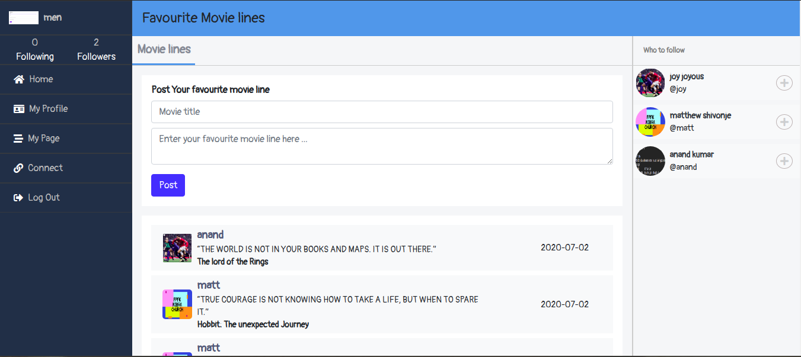

# Favourite Movie Line - Rails

> This is a a ruby on rails capstone project  that entails posting of favourite movie lines and following other users. It captures basic functionalities of social site.

## Live link
[live] 

## Screenshot 


## Presentation
[Video presentation](https://www.loom.com/share/3f34ddfa78db420d806ff92fe31bd9c5)

## Models created
- User
- Line
- Following

## Built With

- Ruby 2.7.1
- Rails 6.0.3.2
- SCSS
- Bootstrap
- Font awesome

### Setup

Instal gems with:

```
bundle install
```

Setup active storage with:

```
   bin/rails active_storage:install 
   bin/rails db:migrate
```

### Usage

1. Create an account by filling in all details and uploading profile and cover photo.
2. In the home page it has navigation links to various pages in the site. It contains details about count of your followers and the those you follow and the profile picture.
3. To edit profile you can visit your My profile and edit photo or other user details.
4. Creating a line is simple, in the home page one can create a line and post it. The most recent post will appear at the top.
5. In the right part it shows a list of top 3 users who you have not followed.
6. You can visit a users page by clicking on the username or to your own page by clicking My Page on the navigation links.
7. On a user's oage you can view their cover photo and all the post that they have made. On the right part you can view detailed information about a user from number of posts, number and sdetails of followers and those they are following same to My page. 


### Run tests

```
    rpsec --format documentation
```

## Author

- Github: [@hillarioh](https://github.com/hillarioh)
- Twitter: [@hillaokri](https://twitter.com/hillaokri)
- Linkedin: [@HillaryOkerio](https://www.linkedin.com/in/hillaryokerio/)

## 🤝 Contributing

Contributions, issues and feature requests are welcome!

## Credit

Original  Design idea by [Gregoire Vella on Behance](https://www.behance.net/gregoirevella) .
The design  [info](https://www.behance.net/gallery/14286087/Twitter-Redesign-of-UI-details)
